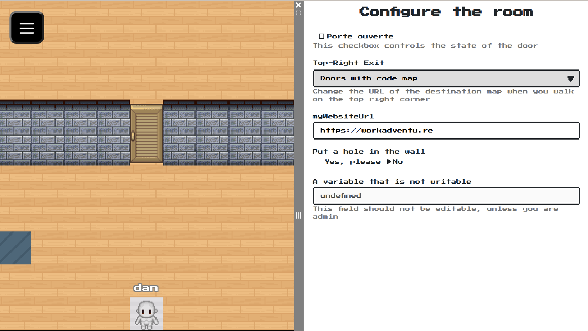
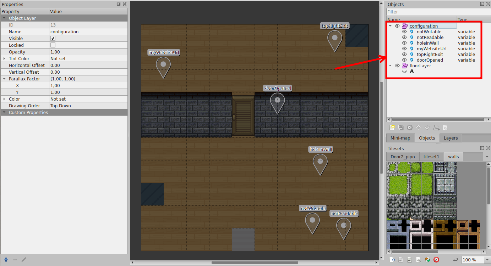
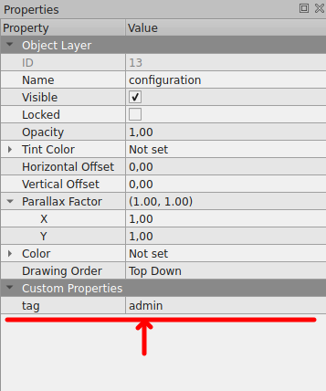
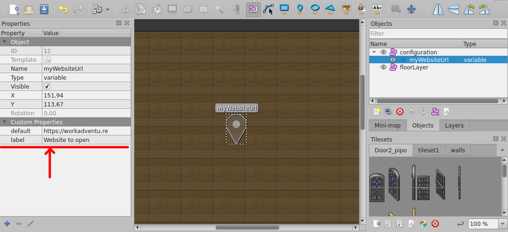
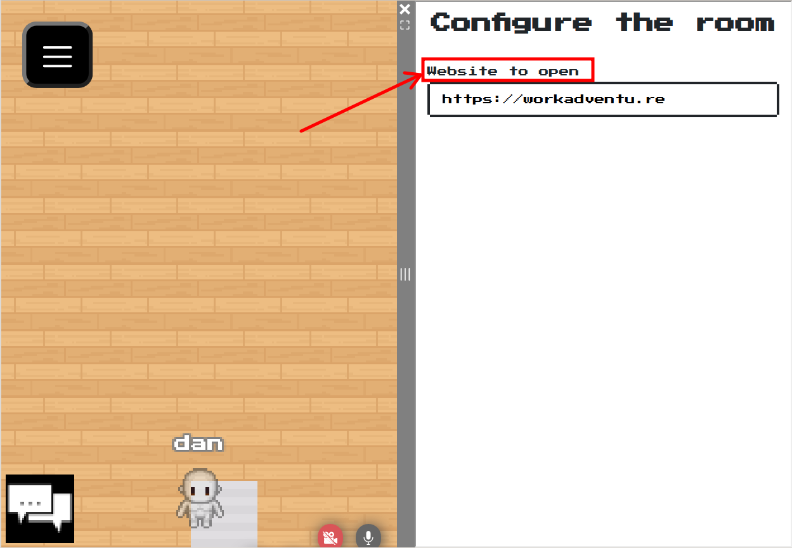
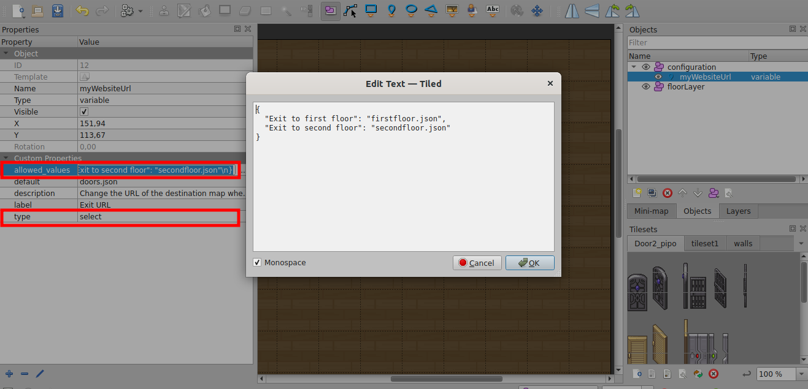
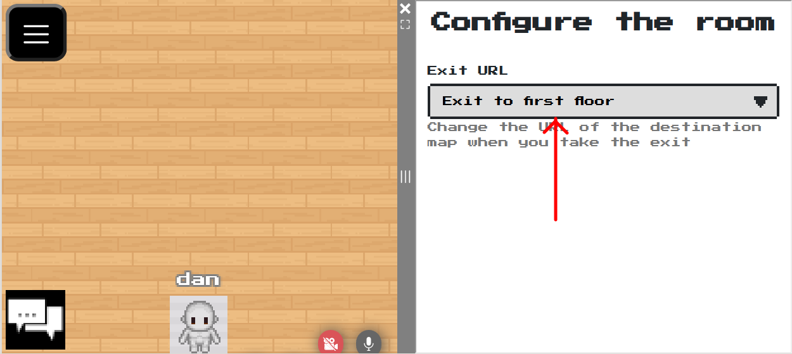
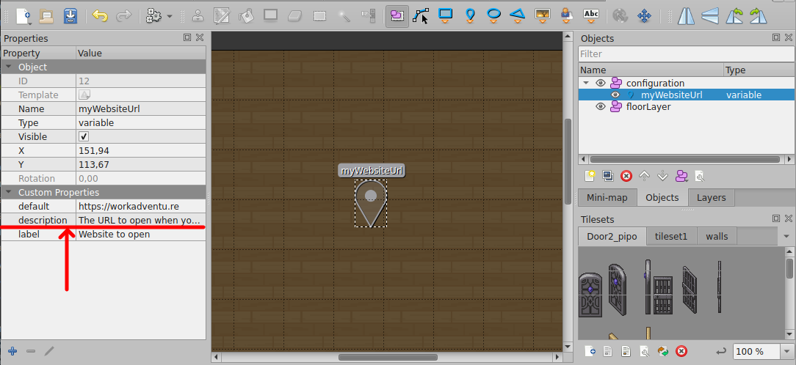
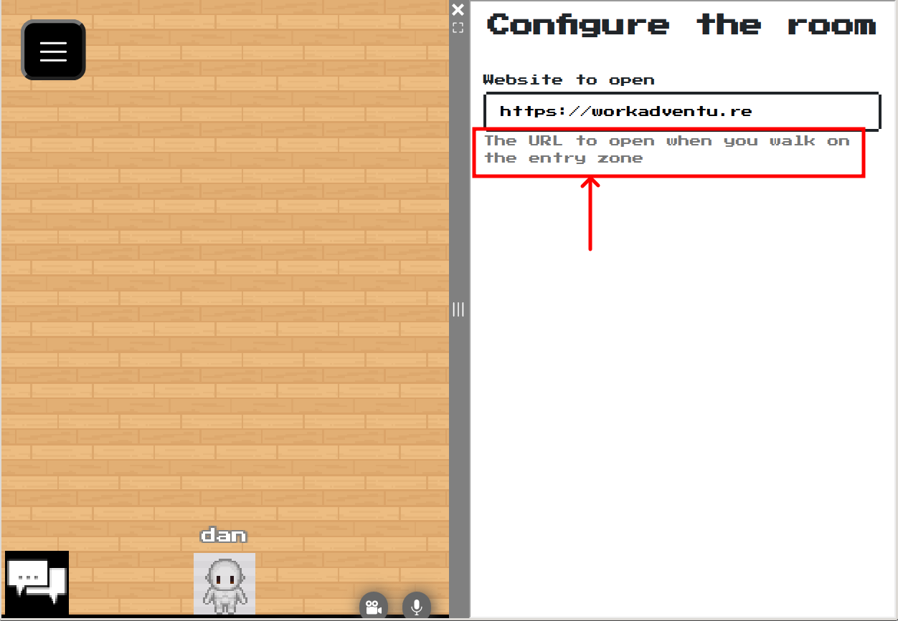

{.section-title.accent.text-primary}
# Generating automatically a configuration screen

{.alert.alert-info}
**Important!** To generate a configuration screen automatically, you need to [import the "Scripting API Extra" script in your map](about.md#importing-the-extended-features)

WorkAdventure comes with a ["variables"](https://workadventu.re/map-building/api-state.md) system that can be used
to change a map dynamically. Variables can have an impact on a map through [property bindings](variable-to-property-binding.md),
or through the [Scripting API](https://workadventu.re/map-building/api-state.md).

In order to edit the value of a variable, the *Scripting API Extra* library comes with a way to define configuration
pages automatically.

The configuration page displays a form that is **generated from the variables** present on the map.
Each variable is mapped to one field in the form.

<figure class="figure">
    
    <figcaption class="figure-caption">A sample configuration screen</figcaption>
</figure>

For a variable to appear in the configuration form, it MUST be stored in a layer called `configuration`.

<figure class="figure">
    
    <figcaption class="figure-caption">List of variables that will be displayed in the configuration screen</figcaption>
</figure>

## Protecting the configuration screen

By default, the configuration screen will be accessible to anyone. You will probably want to restrict the access of the 
configuration screen to users that have a certain *tag*.

To do this, simply add a `tag` property to the configuration layer. The value of the property is the name of the tag
that users must have to access the configuration screen.

<figure class="figure">
    
    <figcaption class="figure-caption">Here, only users with tag "admin" will have access to the configuration screen</figcaption>
</figure>

## Altering the display of a variable

### Changing the label

Each variable is mapped to one field in the form.

By default, the name of the variable is used as the label.

You can add a `label` property on the variable to display a custom label for your variable.

<figure class="figure">
    
    <figcaption class="figure-caption">The label property added to a variable</figcaption>
</figure>

<figure class="figure">
    
    <figcaption class="figure-caption">The label property is used as field label</figcaption>
</figure>

### Changing the type of the field

By default, a variable will be displayed as a text box, unless the `default` property is a boolean, in which case
it will be displayed as a checkbox.

You can alter this type of the field displayed by using the `type` **custom** property.

{.alert.alert-warning}
**Important!** The *type* of the point object  that represents the variable must always be `variable`. You should add
a **custom** property whose name is "type" to set the type of the field.

Acceptable values for the "type" property are:

- `text`: displays a text field
- `checkbox`: displays a checkbox
- `select`: displays a select (see `allowed_values`)
- `radio`: displays radio buttons (see `allowed_values`)

### Enumerations (select / radio buttons)

If you want to display a select box or radio buttons, you need to provide the list of possible values.
This can be done through the `allowed_values` property.

The `allowed_values` must be passed a JSON object whose keys are the text displayed, and whose values are the value that
will take the variable if the option is selected.

For instance, if you want to do a simple "Yes/No" radio button, you would write:

`allowed_values: {
    "Yes": true,
    "No": false
}`

When you use the `allowed_values` property in your variable, do not forget to the the `type` property to `select` or `radio`.

<figure class="figure">
    
    <figcaption class="figure-caption">The "allowed_values" property added to a variable</figcaption>
</figure>

<figure class="figure">
    
    <figcaption class="figure-caption">The field is displayed as a "select" because we chose "type = select"</figcaption>
</figure>

### Adding a description / hint

You can add a `description` property on the variable to display a description of the purpose of the field, below
the field.

<figure class="figure">
    
    <figcaption class="figure-caption">The description property added to a variable</figcaption>
</figure>

<figure class="figure">
    
    <figcaption class="figure-caption">The description property is displayed below the field</figcaption>
</figure>

### Field visibility

The configuration page will respect the visibility rights configured on the variable.

- If the `readableBy` property is set on the variable, the variable will appear in the configuration screen only if the current user has the right
to read this variable.
- If the `writableBy` property is set on the variable, the variable will be displayed, but modifiable only if the current user has the right
to write to this variable. 
