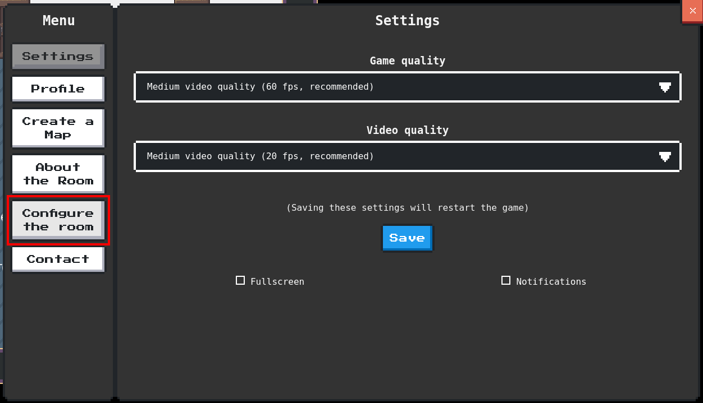
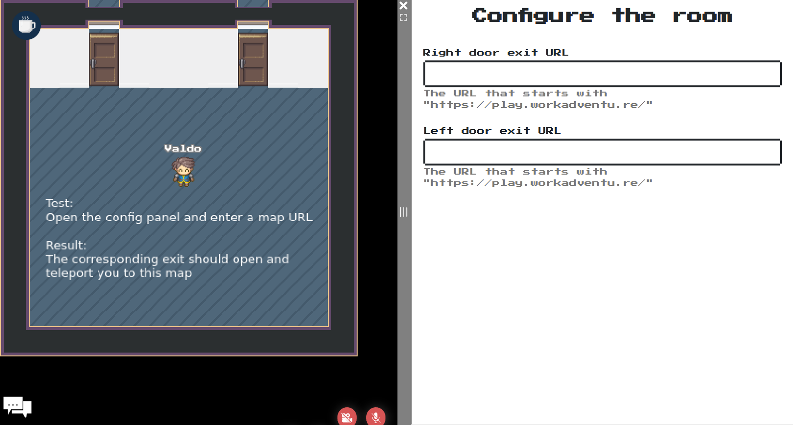
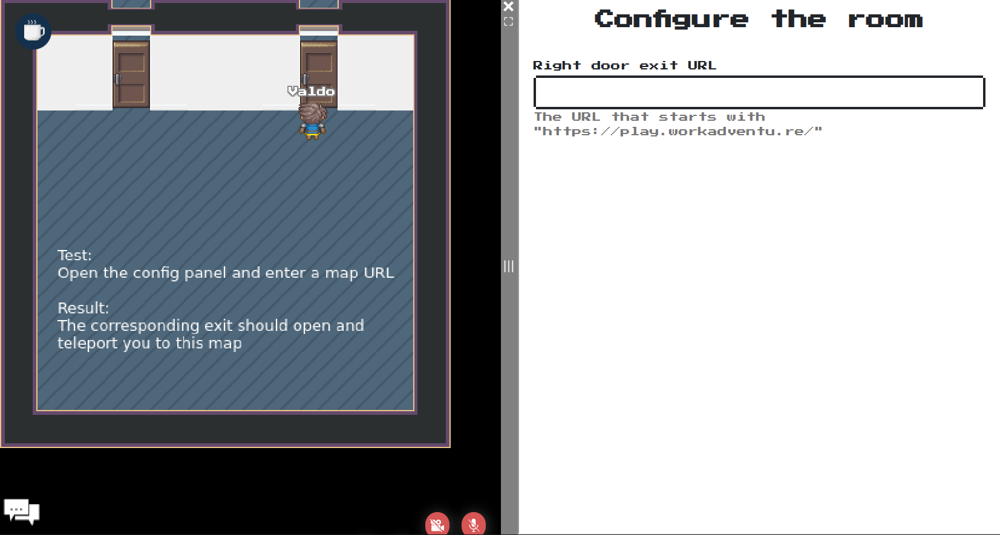
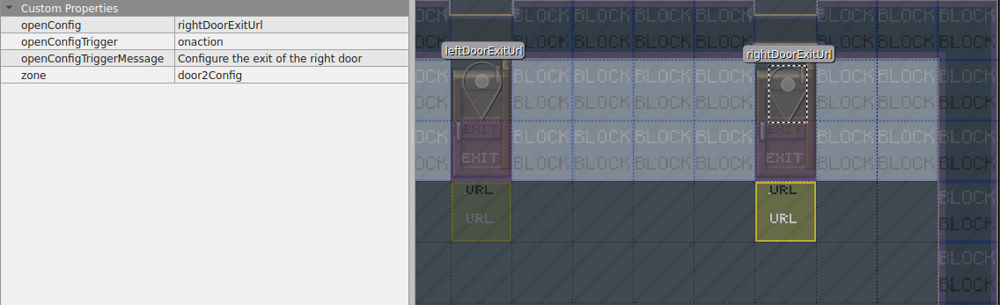
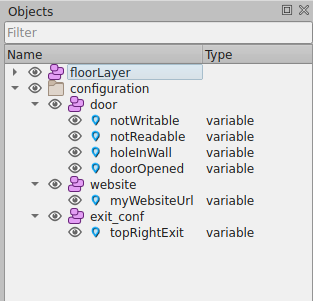
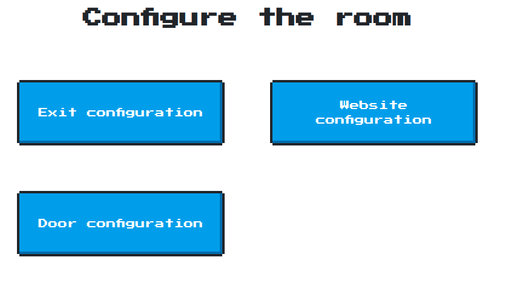

{.section-title.accent.text-primary}
# Generating automatically a configuration screen

{.alert.alert-info}
**Important!** To generate a configuration screen automatically, you need to [import the "Scripting API Extra" script in your map](about.md#importing-the-extended-features)

WorkAdventure comes with a ["variables"](https://workadventu.re/map-building/api-state.md) system that can be used
to change a map dynamically. Variables can have an impact on a map through [property bindings](variable-to-property-binding.md),
or through the [Scripting API](https://workadventu.re/map-building/api-state.md).

In order to edit the value of a variable, the *Scripting API Extra* library comes with a way to define configuration
pages automatically.

The configuration page displays a form that is **generated from the variables** present on the map.
Each variable is mapped to one field in the form.

For a variable to appear in the configuration panel, it MUST be stored in a layer called `configuration`.

<figure class="figure">
    
    <figcaption class="figure-caption">List of variables that will be displayed in the configuration screen</figcaption>
</figure>

Below, we will see the two ways of configuring your variables with the configuration panel.

## Global configuration panel

Having a variable inside a `configuration` object layer will automatically add a button inside the menu, called 'Configure the room'.

<figure class="figure">
    
    <figcaption class="figure-caption">Configure the room button</figcaption>
</figure>

Try to open the menu and check for this new sub-menu. By clicking on the button you should now see the global configuration panel:

<figure class="figure">
    
    <figcaption class="figure-caption">Global configuration panel</figcaption>
</figure>

We call it 'global' because it contains all the variables that the `configuration` layer have.
This is great if you do not have many variables to configure and if they are well organized.
Now, it would be great to see only the variable that interests you in this panel, for example by going in front of a door to open or a website to configure.
We call this 'local' configuration, and you will see it in action right away!

## Local configuration panel

By going in front of this door, the configuration form will contain only the variable that controls the right door:

<figure class="figure">
    
    <figcaption class="figure-caption">Local configuration panel</figcaption>
</figure>

Comparing to the previous screenshot you see only one field, and it's the field that can set the exit URL of this specific door.
To be able to achieve that, all you need to do is to create a layer with the `openConfig` property with the name of the variable to configure as its value.
Because our variable here is called `rightDoorExitUrl` we added `openConfig: rightDoorExitUrl`.

{.alert.alert-info}
**Pro tip:** Note that you can tell the `openConfig` property to include multiple variables by separating the variable names by a comma.
For example: `openConfig: rightDoorExitUrl,leftDoorExitUrl`.
Also, the layer containing openConfig must have a `zone` (string) property as well, but this step will be removed in a future version.

<figure class="figure">
    
    <figcaption class="figure-caption">Local configuration setup</figcaption>
</figure>

You can see that our layer is represented in the game by a single tile (the yellow one) and that `openConfig` is very similar to `openWebsite`!
In fact, it has technically the same effect of opening an iframe, but you can't control the website that will appear, only the number of variables.

If you set `openConfigTrigger: onaction`, when the user walks on the layer, an alert message will be displayed at the bottom of the screen.
If you set `openConfigTriggerMessage: your message action` you can edit the alert message displayed. If not defined, the default message will be 'Press SPACE or touch here to configure'.

## Protecting the configuration screen

By default, the configuration screen will be accessible to anyone. You will probably want to restrict the access of the 
configuration screen to users that have a certain *tag*.

To do this with the global configuration panel, simply add a `tag` property to the configuration object layer. The value of the property is the name of the tag
that users must have to access the configuration screen.

<figure class="figure">
    
    <figcaption class="figure-caption">Here, only users with tag "admin" will have access to the configuration screen</figcaption>
</figure>

You can also protect a local configuration zone by adding the `openConfigAdminTag` property and by setting a tag as value.
Adding `openConfigAdminTag: admin` to a layer that contains `openConfig` will prevent players that don't have the 'admin' tag to see the local configuration panel, as well as the alert to open it.

## Altering the display of a variable

### Changing the label

Each variable is mapped to one field in the form.

By default, the name of the variable is used as the label.

You can add a `label` property on the variable to display a custom label for your variable.

<figure class="figure">
    
    <figcaption class="figure-caption">The label property added to a variable</figcaption>
</figure>

<figure class="figure">
    
    <figcaption class="figure-caption">The label property is used as field label</figcaption>
</figure>

### Changing the type of the field

By default, a variable will be displayed as a text box, unless the `default` property is a boolean, in which case
it will be displayed as a checkbox.

You can alter this type of the field displayed by using the `type` **custom** property.

{.alert.alert-warning}
**Important!** The *type* of the point object  that represents the variable must always be `variable`. You should add
a **custom** property whose name is "type" to set the type of the field.

Acceptable values for the "type" property are:

- `text`: displays a text field
- `checkbox`: displays a checkbox
- `select`: displays a select (see `allowed_values`)
- `radio`: displays radio buttons (see `allowed_values`)

### Enumerations (select / radio buttons)

If you want to display a select box or radio buttons, you need to provide the list of possible values.
This can be done through the `allowed_values` property.

The `allowed_values` must be passed a JSON object whose keys are the text displayed, and whose values are the value that
will take the variable if the option is selected.

For instance, if you want to do a simple "Yes/No" radio button, you would write:

`allowed_values: {
    "Yes": true,
    "No": false
}`

When you use the `allowed_values` property in your variable, do not forget to the the `type` property to `select` or `radio`.

<figure class="figure">
    
    <figcaption class="figure-caption">The "allowed_values" property added to a variable</figcaption>
</figure>

<figure class="figure">
    
    <figcaption class="figure-caption">The field is displayed as a "select" because we chose "type = select"</figcaption>
</figure>

### Adding a description / hint

You can add a `description` property on the variable to display a description of the purpose of the field, below
the field.

<figure class="figure">
    
    <figcaption class="figure-caption">The description property added to a variable</figcaption>
</figure>

<figure class="figure">
    
    <figcaption class="figure-caption">The description property is displayed below the field</figcaption>
</figure>

### Field visibility

The configuration page will respect the visibility rights configured on the variable.

- If the `readableBy` property is set on the variable, the variable will appear in the configuration screen only if the current user has the right
to read this variable.
- If the `writableBy` property is set on the variable, the variable will be displayed, but modifiable only if the current user has the right
to write to this variable. 

## Creating sub-sections

Do you have many variables on your map? You can organize these variables on different configuration pages.
To do this, simply turn the `configuration` layer into a "group" layer. In this group layer, you can put many object
layers. Each object layer will be rendered in a different page.

<figure class="figure">
    
    <figcaption class="figure-caption">Variables are stored in layers inside the "configuration" group layer</figcaption>
</figure>

<figure class="figure">
    
    <figcaption class="figure-caption">Each configuration page is accessible from the main page</figcaption>
</figure>

Each configuration page is accessible from the main page using a menu made of buttons.

The label of the buttons can be edited by setting a custom `label` property on each object layer inside the "configuration" layer.
