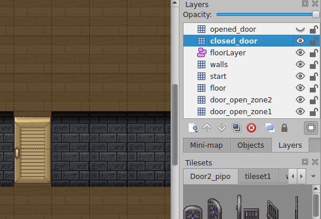
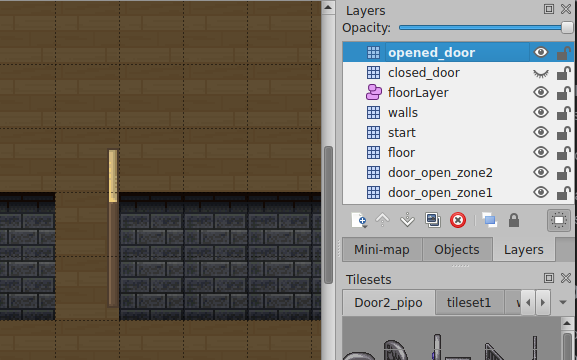
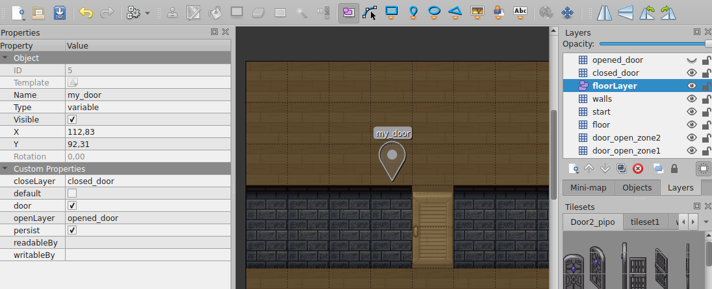
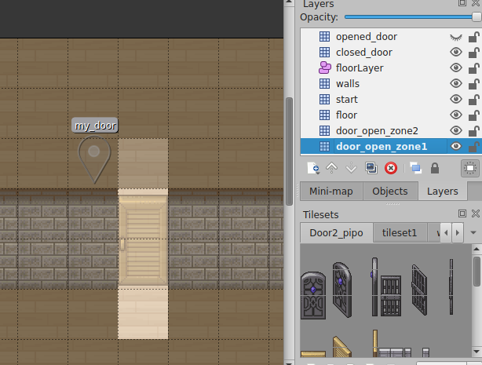
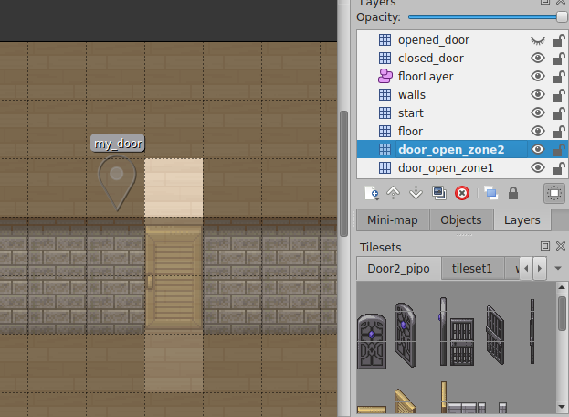
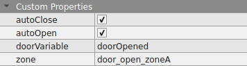
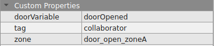
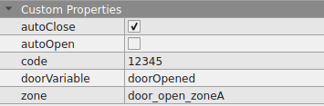
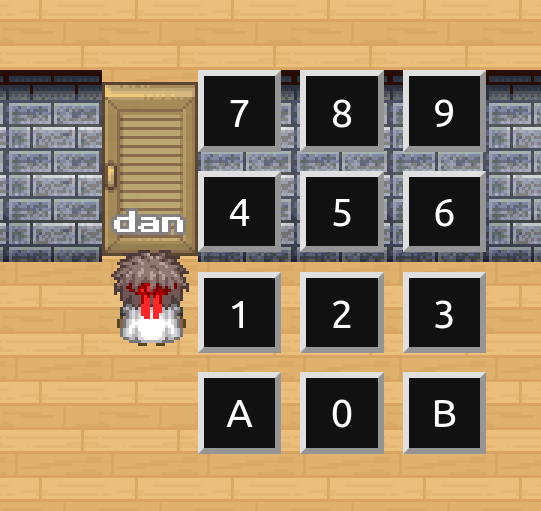

{.section-title.accent.text-primary}
# Doors

{.alert.alert-info}
**Important!** To use the "doors" feature, you need to [import the "Scripting API Extra" script in your map](about.md#importing-the-extended-features)

Doors are extremely customizable in your map. You can:

- decide to open/close the door automatically or on user interaction
- decide who can operate the door (based on the user's tags)
- lock a door with a digit code
- you can even add a bell (look at the [bell](bells.md) dedicated document)

In order to create a door, you will need:

- a tileset containing sprites for the door in an opened and in a closed state
- optionally 2 MP3 files containing the opening and closing sound

{.alert.alert-info}
Looking for cool door sprites? Checkout out [door sprites by Pipoya on itch.io](https://pipoya.itch.io/pipoya-rpg-tileset-32x32/devlog/222435/add-door-animation)

Doors are made of 1 variable and 4 layers. We will see how to build one step by step in this document.

## The open / close layers

The first step is to add 2 layers on your map. One will contain the opened door and one the closed door.

<table>
    <tr>
        <td>
            

                <figure class="figure">
                    
                    <figcaption class="figure-caption">The layer with the closed door</figcaption>
                </figure>
            

        </td>
        <td>
            

                <figure class="figure">
                    
                    <figcaption class="figure-caption">The layer with the opened door</figcaption>
                </figure>
            

        </td>
    </tr>
</table>

{.alert.alert-info}
If you have complex doors that span on several layers, that is fine.

{.alert.alert-warning}
Do not forget to make the closed door tiles "collidable" (using the `collides` property), otherwise users will be able 
to walk through your open door!

## The door variable

Then, add a ["variable"](https://workadventu.re/map-building/api-state.md). The variable will control
the "state" of the door and to share that state between the players. If the variable value is `true`, 
the door will be open, if it is `false`, the door will be closed.

In order to add a variable, you need to create a "Point" on any "object layer" in your map, in Tiled.

<figure class="figure">
    
    <figcaption class="figure-caption">The door variable</figcaption>
</figure>

- You can give this variable any name.
- The "type" of the object MUST be "variable".
- You MUST define a custom boolean property named `door`. The "door" checkbox must be checked.
- You can set the `default` custom property to `true` (opened by default) or `false` (closed by default). This will be used
  the first time a user enters the map.
- You can set the `persist` custom property to `true` if you want to save the state of the door. Otherwise, the door state
  will reset to the `default` property when the room is empty.

Now, add 2 properties to the variable:

- `openLayer`: this MUST contain the name of the opened door layer
- `closeLayer`: this MUST contain the name of the closed door layer

{.alert.alert-info}
**Note:** if your door is spanning over several layers, for both the `openLayer` and `closeLayer` properties, you can input 
several layer names separated by a new line character.

### Opening / closing sound

You can add an opening or closing sound to the door by using the `openSound` or `closeSound` properties of the door variable.

The value of these properties should be a URL to a MP3 file of a sound opening or closing the door.

- `openSound`: URL of the sound of a door opening
- `closeSound`: URL of the sound of a door closing

Anybody on the map will hear the sound of the door opening or closing.

If you want to limit the sound to a certain area, you can use the `soundRadius` property.
`soundRadius` is expressed in pixels. If you are further than `soundRadius` pixels from the center of the door,
you will not hear the door opening or closing. Also, the further you are, the fainter the sound.

{.alert.alert-info}
If you are looking for opening/closing door sounds, [FesliyanStudios provides a variety of sounds](https://www.fesliyanstudios.com/royalty-free-sound-effects-download/opening-closing-door-54)

## Door steps

So far, our door is controlled by the state of a variable. Unless you are mastering the scripting API, you
need a way to change the "state" of the door variable. This is what "door steps" are for!

Door steps are layers or area objects (usually one in front of the door and one behind) that control the opening / closing of the door.

<table>
    <tr>
        <td>
            

                <figure class="figure">
                    
                    <figcaption class="figure-caption">The front door step</figcaption>
                </figure>
            

        </td>
        <td>
            

                <figure class="figure">
                    
                    <figcaption class="figure-caption">The back door step</figcaption>
                </figure>
            

        </td>
    </tr>
</table>

{.alert.alert-info}
**One or two door steps?** Do you want to have different rules for opening / closing the door depending on the side
of the door you are standing? If yes, you will need 2 door steps (and therefore, 2 layers or 2 area objects). For instance, you can have the back 
door step that triggers automatically the opening of the door, while the front door step requires to enter a code to open the door.
One door step layer spanning the 2 sides of the door can be enough if your door behaves the same on both sides.

In order to create a door step, you MUST create an additional layer or an area object and put the following property on it:

- `doorVariable` (string): the name of the door variable that this door step controls

You should see something similar to the video below:

<video alt="Door video manual"
        poster="images/door_manual.png"
        muted="false" autoplay="true" loop="true" controls="controls">
    <source src="images/door_manual.mp4"
            type="video/mp4">
    Sorry, your browser doesn't support embedded videos.
</video>

### Automatically VS manually opening the door

By default, when a player walks next to the door, a user interaction (pressing SPACE) is required to open or close the
door.

You can change this behaviour by setting the `autoOpen` and `autoClose` boolean properties on the **door step layer**.

By setting `autoOpen` to true, the door will automatically open when someone walks in the door step layer. 
By setting `autoClose` to true, the door will automatically close when someone walks out of the door step layer. 

<figure class="figure">
    
    <figcaption class="figure-caption">The autoOpen and autoClose properties</figcaption>
</figure>

 

<video width="398" height="452" 
        alt="Video example opens the door automatically"
        poster="images/open_doors_auto.png"
        muted="false" autoplay="true" loop="true" controls="controls">
    <source src="images/open_doors_auto.mov"
            type="video/quicktime">
    <source src="images/open_doors_auto.mp4"
            type="video/mp4">
    Sorry, your browser doesn't support embedded videos.
</video>

{.alert.alert-info}
Because you set the `autoOpen` and `autoClose` properties on the door step (and not on the door variable),
you can have different behaviour depending on the side of the door you are on. You can create doors
that are opening automatically on one side, but that require manual opening on the other side.

### Configuring the open/close door message

You can change the message displayed to the user to open / close a door with the `openTriggerMessage` and 
`closeTriggerMessage` properties, on the doorstep layer.

### Limiting who can open/close the door

You can decide who is allowed to operate the door based on user tags. 

{.alert.alert-info}
User tags is a feature of the "pro" accounts.

Use the `tag` property on the "door step" layer. In order to operate the door from this layer, the player
will need to have the specified tag.

<figure class="figure">
    
    <figcaption class="figure-caption">Only players with the "collaborator" tag can open/close this door</figcaption>
</figure>

{.alert.alert-info}
You set the `tag` property on the door step (and not on the door variable).
You can therefore put the tag variable outside (the door can be opened only by authorized people), but not on the doorstep
inside (people inside can exit the room, whether they have the tag or not)

### Setting a digital code access on your door

You can protect your door with a digital access code.

Putting a code is as simple as adding a `code` property on your door.

<table>
    <tr>
        <td>
            

                <figure class="figure">
                    
                    <figcaption class="figure-caption">The "code" property</figcaption>
                </figure>
            

        </td>
        <td>
            

                <figure class="figure">
                    
                    <figcaption class="figure-caption">The digital access code</figcaption>
                </figure>
            

        </td>
    </tr>
</table>

The digital access code will be displayed at the right of the closed door.

{.alert.alert-warning}
Protection provided by the "code" property is weak. Indeed, the code is stored in the map that is downloaded by the browser.
Therefore, it is quite easy for an attacker to read the code. The digital access code will prevent regular users from
entering your room, but won't stop someone willing to hack your room.

