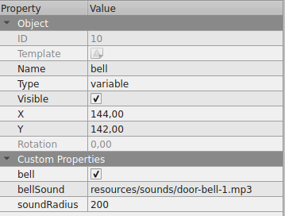
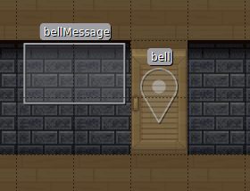
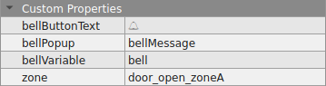

# Bells / Knocking on a door

:::info Important
To use the "bells" feature, you need to [import the "Scripting API Extra" script in your map](../index.md#importing-the-extended-features)
:::

Bells are usually used next to [doors](doors.md) (even if they can be used independently)

You can:

- decide if the bell will ring automatically or by pressing a button
- decide the sound of the bell (or a knocking on the door sound if you prefer)
- decide if the bell can be heard on all the map, or only at a given radius around the bell

## The bell variable

In order to create a bell, you need to create a ["variable"](/developer/map-scripting/references/api-state) that will
be used to share the fact the bell is ringing.
The value of the variable has no importance, it is just used to propagate the event that the bell is ringing.

In order to add a variable, you need to create a "Point" on any "object layer" in your map, in Tiled.

Unlike with classical variables, the position of the variable object is important. The sound will be emitted from this point.

- You can give this variable any name.
- The "type" of the object MUST be "variable".
- You MUST define a custom boolean property named `bell`. The "bell" checkbox must be checked.

Then add 2 properties

- `bellSound`: URL of the sound of the bell ringing (you can also use a knock-knock-knock sound if you have a door :) )
- `soundRadius` (optional): The radius at which one can hear the sound (expressed in pixels, the sound center being **the position of the variable**)

The farther you are from the sound center, the less you will hear the sound. If you don't set any soundRadius, the whole
map will hear the sound.

The URL of the sound can be absolute or relative. If you choose a relative URL, it is is relative to the map.

## The bell display layer

Now, we need to define the position on the map from where the bell sound can be triggered.

Add a tile layer in your map.

On the layer add this property:

- `bellVariable`: (Compulsory) the name of the "bell" variable that will be triggered when someone walks on this layer

With only those 2 properties, whenever a user walks into the layer, the bell will automatically ring.

## Adding a bell button

Of course, most of the time, you want the bell to be triggered by a manual user interaction (pressing the bell button).

To add this button, you should create a "rectangle" object on any object layer in Tiled. The button will appear within this
rectangle object on the map.

Give this rectangle object any name.

Now, on the bell layer, create 2 properties:

- `bellPopup`: the name of a rectangle object on the object layer in the map that will display the "Ring" button to ring the bell.
- `bellButtonText`: the text to display in the button to ring the bell. Defaults to "Ring"

:::info Pro tip
the `bellButtonText` can contain emojis. So you can use the "bell" emoji in the text: 🔔
:::
