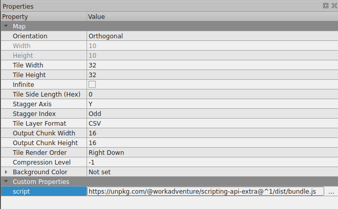

# Scripting Api Extra

WorkAdventure features can be extended through the use of the [scripting API](https://docs.workadventu.re/developer/map-scripting/).

This means anyone can write "scripts" that can be imported in any map and that add new properties to WorkAdventure.
If you are a developer, do not hesitate to have a look at the [scripting API](https://docs.workadventu.re/developer/map-scripting/)
and to create your own custom properties / features.

The WorkAdventure team also provides its own scripts that add various features. We put those features
in a common package we call [Scripting API Extra](https://github.com/workadventure/scripting-api-extra).

In this section, you will find a list of these extended features.

## Importing the "extended features"

Because a script is hosting the extended features, you need to import that script explicitly into your map.

There are 3 ways to import those extended features:

- importing the "Scripting API Extra" library directly in your map
- or importing the "Scripting API Extra" library dynamically from your Javascript script
- or bundling the "Scripting API Extra" library in your own script using NPM and a bundler like Webpack or Vite

:::success
If you are using the [Map Starter Kit](https://github.com/workadventure/map-starter-kit) (as recommended in the WorkAdventure documentation) the "extended features" are
already imported in your map for the `src/main.ts` file of the starter kit. You can skip the following chapters.
:::

### Importing the script in the map

:::warning
We do not recommend this method because you will not be able to import other scripts in your map.
:::

You can do so by adding a `script` property at the top level of your map, pointing to the URL:
`https://unpkg.com/@workadventure/scripting-api-extra@^1/dist/bundle.js`


Importing the "Scripting API Extra" library using the "script" property.

:::info Reminder
To access the map properties in Tiled, you can click on the **Map** > **Map Properties** menu.
:::

### Importing the script dynamically from your Javascript script

If you already have a Javascript script in your map, you can import the scripting API as a module.

:::caution
This method is only recommended for simple scripts. If you are using a Javascript bundler (like Webpack) to build your Javascript
script, have a look at the next section.
:::

To import the "Scripting API Extra" library dynamically from your script, at the top of your JS script, add this line:

```javascript
import { } from "https://unpkg.com/@workadventure/scripting-api-extra@^1";
```

### Bundling the "Scripting API Extra" library in your script

If you already have a script in your map and if this script is built using a bundler like Webpack or Rollup
(this is the case if you are using the [WorkAdventure Map Starter Kit](https://github.com/workadventure/map-starter-kit)),
you can import the "Scripting API Extra" library as a "dependency" of your script.

:::info Note
The WorkAdventure Map Starter Kit is already importing the Scripting API Extra library as a dependency, so you
have nothing to do if you use it for your map.
:::

```
npm install --save @workadventure/scripting-api-extra
```

:::caution
Here, we assume that the script you wrote is using a bundler (like Webpack) and that you already have dependencies in
your project using a `package.json` file. If you are not familiar with NPM, or bundlers, we highly recommend using
the [WorkAdventure Map Starter Kit](https://github.com/workadventure/map-starter-kit) that comes
with sane defaults.
:::

Once the "Scripting API Extra" library is imported, you still need to initialize it. This can be done by calling a
single `bootstrapExtra()` method:

```typescript
import { bootstrapExtra } from "@workadventure/scripting-api-extra";

// Calling bootstrapExtra will initiliaze all the "custom properties"
bootstrapExtra();
```
