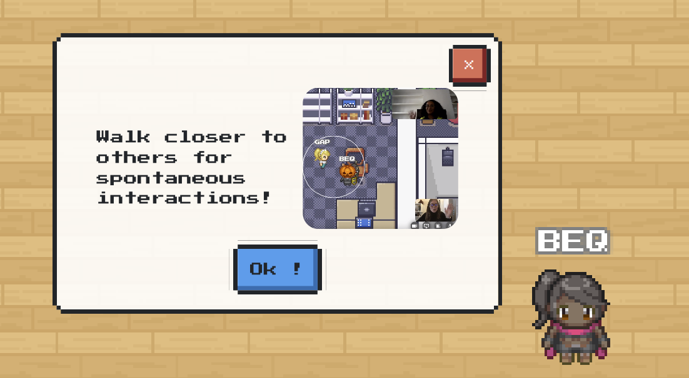
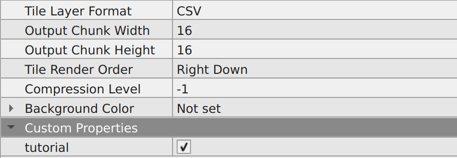

---

sidebar_position: 40
title: Adding a tutorial

---

# Tutorial

:::info Important
To use the "tutorial" feature, you need to [import the "Scripting API Extra" script in your map](/developer/map-scripting/scripting-api-extra/#importing-the-extended-features)
:::

The tutorial displays a few messages in order to teach players how to use WorkAdventure's basic features. It uses the  [player variables](/developer/map-scripting/references/api-player#player-specific-variables) in order to determine if it has not been seen yet and displays the iframe if necessary (if it has not been seen yet).

The tutorial on desktop web browser

To activate it, you only need to add the following property to your map:
- `tutorial`: a boolean that indicates whether the map needs to display the tutorial or not. It should be checked if you wish to have a tutorial.

How to get the tutorial for your maps
