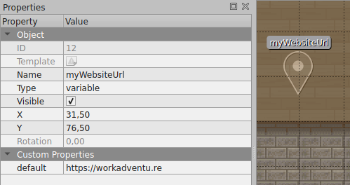
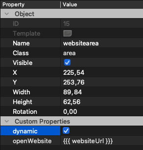
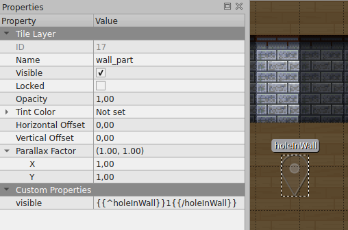

# Binding Variables to Properties

:::info
To use variables to properties binding, you need to [import the "Scripting API Extra" script in your map](/developer/map-scripting/scripting-api-extra/#importing-the-extended-features)
:::

In WorkAdventure maps, ["variables"](/developer/map-scripting/references/api-state) are used to share a state between
players.

Using the Scripting API Extra library, you can bind your variables values directly into properties on your map.

In a property of your map, use the `{{{ variableName }}}` to refer to the name of a property.

**Sample**

Let's imagine you want to dynamically change the URL of a co-website based on a variable value.
You can create a new variable named "myWebsiteUrl" and bind it to the `openWebsite` property of your co-website layer.

The property referring to the variable

## Context

You can use template properties in:

-   any property of any "tile" layer
-   any property of a dynamic "area" object

:::caution
To use bindings with area objects, you must first set the "dynamic" property to true.
:::

It should be noted that "dynamic" areas are accessible via the scripting API but are not editable in the (upcoming) map editor.

_The Dynamic custom property_

## Configuration

Binding variables to properties can make your map reactive to variable changes, but you still need to find a way
to modify the values of variables. There are plenty of ways to do this, including:

-   [Using the scripting API](https://docs.workadventu.re/developer/map-scripting/references/api-state)
-   [Using auto-generated configuration screen](automatic-configuration)
-   [Using generic action layers](generic-action-layers)

## About bindings

Use `{{{ variableName }}}` to refer to a variable name.

Behind the scene the [Mustache templating engine](<https://en.wikipedia.org/wiki/Mustache_(template_system)>) is used.
This means you can use all the features of Mustache like conditional:

`openWebsite: {{#enableWebsite}}https://example.com{{/enableWebsite}}`

The website above will be displayed only if the `enableWebsite` variable is set to `true`.

:::caution
Be sure to use `{{{ variableName }}}` for binding variable and NOT `{{ variableName }}`. The version with a double
curly-braces will work most of the time, but it escapes HTML characters (which is not needed in properties of a map)
and this might cause weird behaviours (like breaking URLs)
:::

## The special "visible" property

You can control the visibility of a layer with the `visible` **custom** property.

If this custom property is set, it will override the "Visible" property of the layer.

If you bind it to a variable, you can display or hide a layer based on the value of a variable.

Usage of the `visible` property

### Inverting a boolean variable

In the example above, the `holeInWall` property is a boolean variable. If it is set to `true`, we want to hide the
layer. So we are setting a `visible` property on the layer. If we put `visible: {{{ holeInWall }}}` the layer
would be visible when `holeInWall` is `true`. But here, we want the opposite: the layer must be displayed when
`holeInWall` variable is `false`. To do this, we can use Mustache's "inverted sections" (delimited by `{{^variable}}...{{/variable}}`).
This section will be displayed if the variable is false or empty.

Therefore, `{{^holeInWall}}1{{/holeInWall}}` will return "1" when the value of `holeInWall` is false, and will be empty otherwise.
