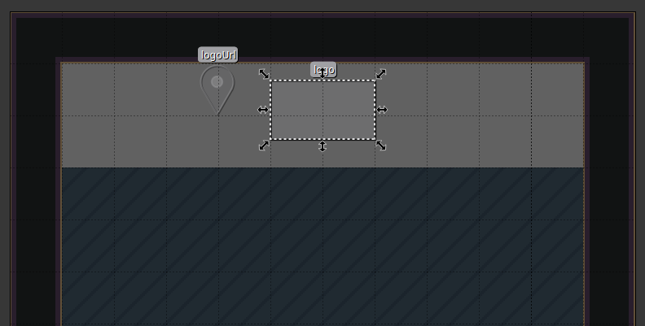

{.section-title.accent.text-primary}
# Logo upload

{.alert.alert-info}
**Important!** To use the "logo upload" feature, you need to [import the "Scripting API Extra" script in your map](about.md#importing-the-extended-features)

The logo upload feature let you customize your maps in a simple way.
By defining some objects and properties in Tiled you can have a logo appearing in your map. Combined with the local configuration feature,
you will have the possibility to change your logo at any time just be heading in front of him and by uploading your brand-new logo file! 

To achieve this you will need to define 1 layer, 1 object layer and 2 objects in Tiled.

<figure class="figure">
    
    <figcaption class="figure-caption">Logo upload demo</figcaption>
</figure>

Let's see how this can be done!

## The variable

{.alert.alert-info}
You can read more about variables [here](https://workadventu.re/map-building/variables.md).

First things first, let's create the variable that will hold the logo URL of the uploaded file.
Fo this to happen, you need first to upload an image, right?

That's why when creating the variable you will pass a `type: "upload"` to its properties, this will have the effect of displaying an upload button in the configuration panel.

For the upload input to appear in the configuration panel you MUST move this variable object inside an object layer called `configuration`.

<figure class="figure">
    
    <figcaption class="figure-caption">Variable object</figcaption>
</figure>

<figure class="figure">
    
    <figcaption class="figure-caption">Variable properties</figcaption>
</figure>

As you can see, besides defining the new `upload` type we can also pass optional properties that will restrict the width and height of you image.
Specify the number of pixels in width as `imageWidth` value and the number of pixels in height as `imageHeight` value.

## The embedded website

{.alert.alert-info}
You can read more about embedded websites [here](https://workadventu.re/map-building/website-in-map.md).

<figure class="figure">
    
    <figcaption class="figure-caption">Embedded website object</figcaption>
</figure>

Create a rectangle object outside the `configuration` object layer (in `floorLayer` for example), this will be out iFrame zone that will be in charge of displaying the actual image.
You have to set its properties to allow the iFrame to interact with external programs (`allowApi: true`) and set the `url` to use the value of the previously defined variable.

<figure class="figure">
    
    <figcaption class="figure-caption">Embedded website properties</figcaption>
</figure>

Now, what we are trying to say with this mustache syntax *(it complicates things a bit, but it's actually simple)* is "If there is a URL inside the variable 'logoUrl', pick this URL, otherwise just display another default image": `{{#logoUrl}}{{{logoUrl}}}{{/logoUrl}}{{^logoUrl}}https://workadventu.re/favicon-32x32.png{{/logoUrl}}`.

## The configuration layer

{.alert.alert-info}
You can read more about the local configuration layer [here](https://workadventu.re/map-building-extra/automatic-configuration.md#local-configuration-panel).

We have the variable object that will hold the image URL, we have the zone to display it, now the final step is to define a zone to be able to upload some new images by configuring the variable value.

We just draw a single tile in front of the logo in a dedicated layer. In its properties we specify the name of the variable to configure with `openConfig: logoUrl`.

<figure class="figure">
    
    <figcaption class="figure-caption">Configuration tile</figcaption>
</figure>

{.alert.alert-info}
The rest of the properties are not mandatory. You can restrict who can access to this configuration as well.

<figure class="figure">
    
    <figcaption class="figure-caption">Configuration properties</figcaption>
</figure>

## Let's recap

To recap, we created 2 objects. One must be in the `configuration` object layer in order to be configurable.

<figure class="figure">
    
    <figcaption class="figure-caption">Map objects</figcaption>
</figure>

Then, apart from the layers we used to create for a map, we created a layer that will have one tile. This will be the zone in which you can walk to open the local configuration panel. We named this layer 'logoConfiguration'.

<figure class="figure">
    
    <figcaption class="figure-caption">Map layers</figcaption>
</figure>

That's it! This feature will be integrated with all of our preset maps.

<figure class="figure">
    
    <figcaption class="figure-caption">Logo upload demo</figcaption>
</figure>

If you want to integrate it yourself into your awesome custom map, now you can!
You can find the full code of the map that tests the logo upload feature [here](https://github.com/workadventure/scripting-api-extra/blob/main/test/maps/configuration_logo.json).
