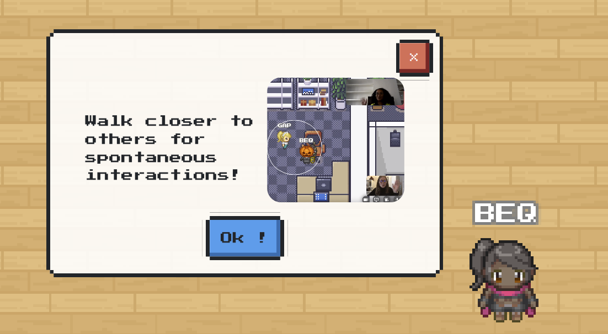
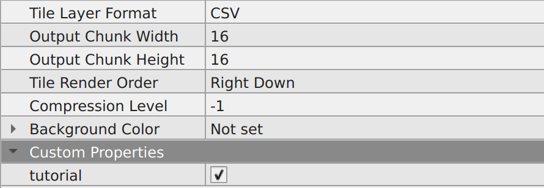

{.section-title.accent.text-primary}
# Tutorial

{.alert.alert-info}
**Important!** To use the "tutorial" feature, you need to [import the "Scripting API Extra" script in your map](about.md#importing-the-extended-features)

The tutorial displays a few messages in order to teach players how to use WorkAdventure's basic features. It uses the  [player variables](https://workadventu.re/map-building/api-player.md#player-specific-variables) in order to determine if it has not been seen yet and displays the iframe if necessary (if it has not been seen yet). 

<figure class="figure">
    
    <figcaption class="figure-caption">The tutorial on desktop web browser</figcaption>
</figure>

To activate it, you only need to add the following property to your map:
- `tutorial`: a boolean that indicates wether the map needs to display the tutorial or not. It should be checked if you wish to have a tutorial.
<figure class="figure">
    
    <figcaption class="figure-caption">How to get the tutorial for your maps</figcaption>
</figure>

